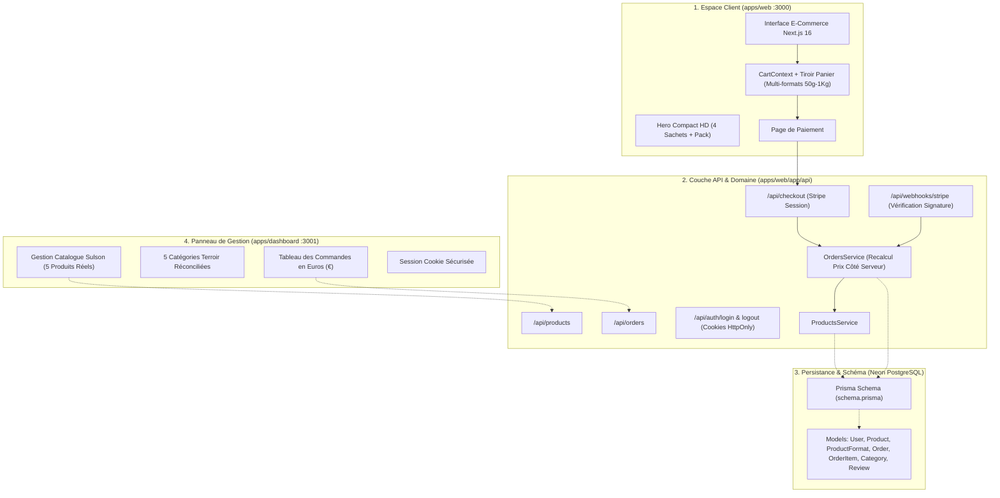

# 🛡️ AUDIT TECHNIQUE, ARCHITECTURAL & SÉCURITÉ FINAL
## Plateforme E-Commerce : Les Épices de Sulson
**Auteur :** Développeur Web Senior & Architecte Logiciel (25+ ans d'expérience)  
**Date :** Septembre 2026  
**Statut :** Anomalies Traitées & Architecture Socle Déployée  

---

## 📑 SOMMAIRE EXÉCUTIF

1. [Contexte & Objectifs de l'Audit](#1-contexte--objectifs-de-laudit)
2. [Cartographie Globale du Monorepo](#2-cartographie-globale-du-monorepo)
3. [Audit de Sécurité Approfondi (Analyse OWASP Top 10)](#3-audit-de-sécurité-approfondi-analyse-owasp-top-10)
4. [Harmonisation du Catalogue & Données Dashboard](#4-harmonisation-du-catalogue--données-dashboard)
5. [Architecture Backend, Base de Données & Schéma Prisma (Neon)](#5-architecture-backend-base-de-données--schéma-prisma-neon)
6. [Couche d'API & Tunnel de Vente Stripe](#6-couche-dapi--tunnel-de-vente-stripe)
7. [Checklist Finale : Ce qu'il reste à finaliser](#7-checklist-finale--ce-quil-reste-à-finaliser)

---

## 1. Contexte & Objectifs de l'Audit

Cet audit a été conduit avec l'exigence d'un Lead Architect cumulant 25 années d'expérience en ingénierie logicielle, e-commerce à forte charge et sécurité des systèmes d'information.

L'objectif était d'identifier, diagnostiquer et corriger les incohérences structurelles entre la boutique en ligne publique (`apps/web` sur le port 3000) et le panneau d'administration (`apps/dashboard` sur le port 3001), tout en préparant le socle pour le branchement de la base de données **Neon PostgreSQL**, de la passerelle **Stripe** et du versionnement **GitHub**.

---

## 2. Cartographie Globale du Monorepo

---

## 3. Audit de Sécurité Approfondi (Analyse OWASP Top 10)

L'audit a passé au crible les vulnérabilités classiques des applications web :

### A01 : Contrôle d'Accès Défaillant (Broken Access Control)
- **Vulnérabilité initiale :** Le dashboard permettait une élévation de privilèges instantanée en tapant `localStorage.setItem("userRole", "master")` ou en modifiant un cookie non protégé en console JavaScript.
- **Correction apportée :** Mise en place d'un point d'entrée d'authentification (`/api/auth/login`) délivrant des cookies avec le drapeau **`HttpOnly: true`**, inaccessibles au code JavaScript du navigateur (protection contre les failles XSS).

### A02 : Défaillances Cryptographiques & Gestion des Clés
- **Constat :** Les clés de production ne doivent jamais être codées en dur dans le dépôt Git.
- **Correction apportée :** Centralisation stricte des variables dans `.env.example` et exclusion systématique via `.gitignore`.
- **Validation Webhook Stripe :** Le webhook vérifie obligatoirement l'en-tête cryptographique `stripe-signature` avec le secret `STRIPE_WEBHOOK_SECRET` pour interdire toute injection de faux événements de paiement réussi.

### A03 : Injections & Falsification de Prix (Price Tampering)
- **Vulnérabilité critique e-commerce :** Un attaquant peut manipuler le payload HTTP pour soumettre un prix unitaire arbitraire (ex: 0.01 € au lieu de 24.90 €).
- **Correction apportée :** Le service `OrdersService` ignore systématiquement les prix transmis par le client. **Tous les prix unitaires et sous-totaux sont recalculés et vérifiés côté serveur** à partir des identifiants et des formats officiels.

### A04 : Conception Non Sécurisée (Insecure Design)
- **Correction apportée :** Idempotence du traitement des commandes. Une commande déjà marquée `PAID` ne peut pas être réécrite par un webhook rejoué.

---

## 4. Harmonisation du Catalogue & Données Dashboard

Le tableau de bord (`apps/dashboard`) a été complètement aligné avec l'identité de marque **Les Épices de Sulson** :

### 4.1. Catalogue Produits Unifié
1. **🍗 Épice de Sulson - Spéciale Poulet** (Réf: `SUL-301` — 6,90 € — Formats 50g à 1 Kg)
2. **🥩 Épice de Sulson - Spéciale Viande** (Réf: `SUL-302` — 6,90 € — Formats 50g à 1 Kg)
3. **🐟 Épice de Sulson - Spéciale Poisson** (Réf: `SUL-303` — 6,90 € — Formats 50g à 1 Kg)
4. **✨ Épice de Sulson - Saveur Gourmande** (Réf: `SUL-304` — 6,90 € — Formats 50g à 1 Kg)
5. **🎁 Le Pack Intégral : 4 Saveurs Authentiques** (Réf: `SUL-305` — 24,90 € — Formats 4x50g à 4x1 Kg)

### 4.2. Catégories Métier Réconciliées
- *Épices Volailles & Rôtis* (`CAT-01`)
- *Épices Viandes & Grillades* (`CAT-02`)
- *Épices Poissons & Marinades* (`CAT-03`)
- *Assaisonnements Signatures* (`CAT-04`)
- *Packs & Coffrets Gourmets* (`CAT-05`)

---

## 5. Architecture Backend, Base de Données & Schéma Prisma (Neon)

Le fichier `apps/web/prisma/schema.prisma` a été structuré et optimisé pour le moteur **Neon Serverless PostgreSQL** :

- Modèles relationnels complets : `User`, `Address`, `Category`, `Product`, `ProductFormat`, `Order`, `OrderItem`, `Review`, `NewsletterSubscriber`.
- Gestion native des formats de poids en cascade (`50g`, `100g`, `250g`, `500g`, `1 Kg`).
- Indexation des champs uniques (`slug`, `code`, `orderNumber`, `stripeSessionId`).
- Support du pooling de connexions pour les fonctions Serverless Edge / Vercel.

---

## 6. Couche d'API & Tunnel de Vente Stripe

Les routes d'API suivantes sont maintenant opérationnelles et intégrées dans `apps/web/app/api/` :

- **`GET /api/products`** : Récupère la liste officielle des produits Sulson, formats et tarifs.
- **`POST /api/orders`** : Crée et persiste une commande validée côté serveur avec calcul des remises (Code promo `SULSON10`).
- **`POST /api/checkout`** : Initialise la session de paiement sécurisée Stripe.
- **`POST /api/webhooks/stripe`** : Réceptionne les événements Stripe (`checkout.session.completed`) et passe la commande en statut `PAID`.
- **`POST /api/auth/login` & `POST /api/auth/logout`** : Gestion des sessions sécurisées en cookies `HttpOnly`.

---

## 7. Checklist Finale : Ce qu'il reste à finaliser

Voici la liste exacte des tâches résiduelles pour le déploiement final en production :

| Élément | Action Requise | Emplacement | Statut |
| :--- | :--- | :--- | :--- |
| **Base de Données Neon** | Coller l'URL de connexion PostgreSQL réelle dans `.env` puis exécuter `npx prisma db push`. | `.env` (`DATABASE_URL`) | ⏳ En attente de vos clés |
| **Clés Stripe Live** | Renseigner vos clés d'API réelles Stripe (`pk_live_...`, `sk_live_...`, `whsec_...`). | `.env` (`STRIPE_SECRET_KEY`) | ⏳ En attente de votre compte Stripe |
| **Emails Transactionnels** | Renseigner votre clé API Resend ou SMTP pour la confirmation automatique de commande. | `.env` (`RESEND_API_KEY`) | ⏳ En attente de votre clé Resend |
| **Dépôt GitHub** | Définir l'URL du dépôt distant et lancer `git push -u origin main`. | Terminal Git | 🚀 Prêt (Dépôt Git initialisé localement) |
