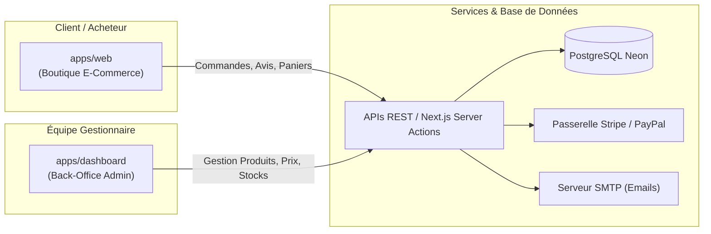
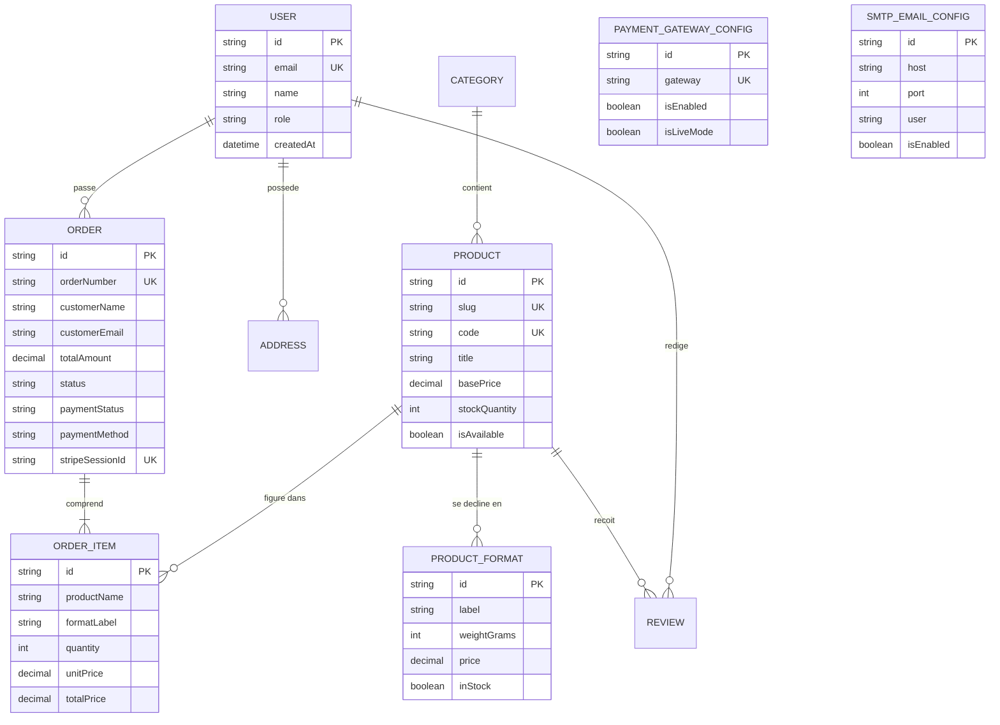

# 🌿 LISTE EXHAUSTIVE DES FONCTIONNALITÉS — LES ÉPICES DE SULSON

> **Document de Référence Fonctionnelle et Technique**  
> **Plateforme :** E-Commerce Éco-Système Complet (*Les Épices de Sulson*)  
> **Architecture :** Monorepo Next.js 16 (App Router) + PostgreSQL (Neon) + Prisma ORM + Stripe / PayPal  
> **Dernière mise à jour :** Septembre 2026  

---

## 📑 TABLE DES MATIÈRES

1. [Vue d'Ensemble & Architecture de la Plateforme](#1-vue-densemble--architecture-de-la-plateforme)
2. [Boutique Publique & Expérience Client (`apps/web`)](#2-boutique-publique--expérience-client-appsweb)
   - [2.1 Page d'Accueil & Merchandising Visuel](#21-page-daccueil--merchandising-visuel)
   - [2.2 Fiches Produits & Multi-Formats (100g & Packs)](#22-fiches-produits--multi-formats-100g--packs)
   - [2.3 Gestion du Panier & Tiroir Latéral (Cart Drawer)](#23-gestion-du-panier--tiroir-latéral-cart-drawer)
   - [2.4 Tunnel d'Achat & Checkout Haute Sécurité](#24-tunnel-dachat--checkout-haute-sécurité)
   - [2.5 Passerelles de Paiement Sécurisées (Stripe & PayPal)](#25-passerelles-de-paiement-sécurisées-stripe--paypal)
   - [2.6 Facturation Automatisée & Emails Transactionnels (SMTP)](#26-facturation-automatisée--emails-transactionnels-smtp)
   - [2.7 Assistant Virtuel IA & Redirection WhatsApp Directe](#27-assistant-virtuel-ia--redirection-whatsapp-directe)
   - [2.8 Espace Compte Client & Historique](#28-espace-compte-client--historique)
   - [2.9 Preuve Sociale, Avis Clients & Témoignages Vérifiés](#29-preuve-sociale-avis-clients--témoignages-vérifiés)
   - [2.10 Outils de Décision : Comparateur & Liste de Souhaits](#210-outils-de-décision--comparateur--liste-de-souhaits)
   - [2.11 Blog Culinaire & Guides de Recettes](#211-blog-culinaire--guides-de-recettes)
   - [2.12 Conformité Juridique, RGPD & FAQ Interactive](#212-conformité-juridique-rgpd--faq-interactive)
   - [2.13 SEO Avancé, Rich Snippets & Performance](#213-seo-avancé-rich-snippets--performance)
3. [Tableau de Bord & Gestion Administrateur (`apps/dashboard`)](#3-tableau-de-bord--gestion-administrateur-appsdashboard)
   - [3.1 Authentification Sécurisée & Contrôle des Rôles](#31-authentification-sécurisée--contrôle-des-rôles)
   - [3.2 Vue d'Ensemble & Métriques de Vente](#32-vue-densemble--métriques-de-vente)
   - [3.3 Gestion Complète du Catalogue (CRUD Produits & Formats)](#33-gestion-complète-du-catalogue-crud-produits--formats)
   - [3.4 Pilotage des Stocks en Temps Réel](#34-pilotage-des-stocks-en-temps-réel)
   - [3.5 Gestion des Commandes & Statuts de Livraison](#35-gestion-des-commandes--statuts-de-livraison)
   - [3.6 Gestion des Retours & Remboursements](#36-gestion-des-retours--remboursements)
   - [3.7 Suivi des Paniers Abandonnés](#37-suivi-des-paniers-abandonnés)
   - [3.8 Suivi des Transactions & Réconciliation Financière](#38-suivi-des-transactions--réconciliation-financière)
   - [3.9 Modération des Avis & Commentaires Clients](#39-modération-des-avis--commentaires-clients)
   - [3.10 Centre de Configuration Global](#310-centre-de-configuration-global)
   - [3.11 Support Client & Boîte de Réception](#311-support-client--boîte-de-réception)
4. [Socle Technique, Sécurité & Résilience](#4-socle-technique-sécurité--résilience)
5. [Schéma de Données Relationnel (Prisma / Neon)](#5-schéma-de-données-relationnel-prisma--neon)

---

## 1. Vue d'Ensemble & Architecture de la Plateforme

La plateforme e-commerce **Les Épices de Sulson** repose sur une architecture en **Monorepo Next.js 16** haute performance scindée en deux applications interconnectées :

1. **`apps/web` (Port 3000 / `epicesdesulson.com`)** : Boutique en ligne vitrine et tunnel d'achat ultra-rapide optimisé pour la conversion sur mobile et desktop.
2. **`apps/dashboard` (Port 3001 / `admin.epicesdesulson.com`)** : Panneau d'administration réservé à l'équipe de gestion pour administrer les ventes, stocks, paiements, clients et paramètres.
3. **`Base de Données Neon PostgreSQL`** : Stockage centralisé managé avec pooling de connexions pour des temps de réponse instantanés sous forte charge.

---

## 2. Boutique Publique & Expérience Client (`apps/web`)

### 2.1 Page d'Accueil & Merchandising Visuel
- **Hero Section Premium HD** : Mise en valeur des 4 sachets authentiques (*Poulet, Viande, Poisson, Gourmande*) et du *Pack Intégral 4 Saveurs*.
- **Réassurance Immédiate** : Badges vectoriels épurés (100% Naturel, Recette Ancestrale sans additifs, Expédition rapide 24/48h, Paiement 100% sécurisé).
- **Moteur de Sélection Directe** : Possibilité d'ajouter les produits phares au panier directement depuis la page d'accueil.
- **Preuve Sociale Intégrée** : Affichage dynamique de la note globale (4.9/5) et carrousel des derniers avis clients certifiés.
- **Section Histoire & Terroir** : Récit authentique des traditions culinaires camerounaises et de la sélection des épices nobles.

---

### 2.2 Fiches Produits & Multi-Formats (100g & Packs)
- **Visualisation Recto/Verso Haute Résolution** : Galerie d'images HD montrant le packaging officiel des sachets de Sulson.
- **Sélecteur de Conditionnement Dynamique** :
  - Standard : **Sachet 100g** (6,90 €)
  - Coffret : **Pack 4x100g / 400g** (24,90 €)
  - *Extensible nativement* : formats 50g, 250g, 500g, 1 Kg.
- **Calculateur de Prix Instantané** : Mise à jour en direct du tarif unitaire, des économies réalisées sur les packs et du stock restant.
- **Descriptions Gastronomiques Riches** : Ingrédients détaillés, conseils d'utilisation (saupoudrage, marinades, rôtis), profil aromatique et accords culinaires recommandés.
- **Onglets Interactifs** : Description complète, Fiche technique & Origine, Avis clients avec formulaire de notation.

---

### 2.3 Gestion du Panier & Tiroir Latéral (Cart Drawer)
- **Tiroir Panier Ajax (Cart Drawer)** : Ouverture fluide sans rechargement de page lors de chaque ajout au panier.
- **Persistance des Données** : Sauvegarde automatique du panier dans le stockage local du navigateur (`CartContext`) pour éviter toute perte lors de la navigation.
- **Contrôle Quantitatif Fin** : Boutons d'incrémentation (+/-), suppression d'article en 1 clic et recalcul immédiat du sous-total.
- **Barre de Progression Livraison Gratuite** : Jauge interactive incitant à compléter le panier pour débloquer les frais de port offerts.
- **Accès Rapide (Quick View)** : Modale de prévisualisation rapide d'un produit depuis n'importe quel listing.

---

### 2.4 Tunnel d'Achat & Checkout Haute Sécurité
- **Formulaire de Commande Ergonomique** : Saisie structurée des coordonnées clients (Nom, Prénom, Email, Téléphone, Adresse postale de livraison).
- **Recalcul Côté Serveur (Anti-Falsification)** :
  - Le frontend ne transmet aucun montant modifiable par l'utilisateur.
  - Le service backend `OrdersService` recalcule chaque article selon la référence produit en base de données.
- **Gestion des Frais de Port & Réductions** : Calcul automatique des options de livraison et application des codes promotionnels éventuels.
- **Création de Commande Pré-Paiement** : Génération d'un numéro de commande unique (ex: `SUL-10842`) avec statut initial `PENDING`.

---

### 2.5 Passerelles de Paiement Sécurisées (Stripe & PayPal)
- **Intégration Stripe Checkout & Elements** :
  - Prise en charge des Cartes Bancaires (CB, Visa, Mastercard, American Express).
  - Prise en charge d'**Apple Pay** et **Google Pay** sur les terminaux compatibles.
  - Chiffrement SSL 256-bit et conformité stricte aux normes bancaires PCI-DSS.
- **Intégration PayPal** : Bouton de paiement express avec redirection sécurisée et capture immédiate des fonds.
- **Webhooks Stripe avec Signature Cryptographique** :
  - Réception de l'événement `checkout.session.completed`.
  - Validation du header `stripe-signature` avec la clé secrète `STRIPE_WEBHOOK_SECRET`.
  - Mise à jour automatique de la commande en `PAID` / `PROCESSING` et décrémentation des stocks.
  - Idempotence garantie : aucun risque de doublon de commande ou de notification.

---

### 2.6 Facturation Automatisée & Emails Transactionnels (SMTP)
- **Génération Dynamique de Factures** : Endpoint `/api/orders/[id]/invoice` générant une facture officielle normée (TVA, coordonnées vendeur/acheteur, détail des lignes, montants).
- **Service d'Emails Transactionnels (`lib/email.ts`)** :
  - Connexion SMTP configurable (Gmail, OVH, Infomaniak, Resend, Sendgrid).
  - Envoi instantané d'un email de confirmation de commande après paiement avec récapitulatif graphique complet et bouton de téléchargement de la facture.

---

### 2.7 Assistant Virtuel IA & Redirection WhatsApp Directe
- **Chatbot Gastronomique Dédié (`chatbot-engine.ts`)** :
  - Assistant conversationnel capable de répondre aux questions sur les 4 saveurs, les conseils de cuisson, les marinades, la conservation et les délais de livraison.
  - Base de connaissances intégrée adaptée aux Épices de Sulson.
- **Redirection WhatsApp 1 Clic** :
  - Bouton flottant permanent permettant de basculer instantanément la conversation vers le numéro WhatsApp officiel du service client.
  - Pré-remplissage du message selon la page visitée ou le produit consulté.

---

### 2.8 Espace Compte Client & Historique
- **Authentification Sécurisée** : Inscription et connexion par email/mot de passe avec sessions sécurisées.
- **Tableau de Bord Client (`/my-account`)** :
  - Carnet d'adresses de livraison et de facturation pré-enregistrées.
  - Historique complet des commandes passées avec état de suivi en direct.
  - Téléchargement des factures des commandes antérieures.

---

### 2.9 Preuve Sociale, Avis Clients & Témoignages Vérifiés
- **Système d'Évaluation 5 Étoiles** : Notation globale et par critères (saveur, parfum, conditionnement).
- **Dépôt d'Avis Modéré** : Formulaire pour les acheteurs vérifiés avec validation préalable dans le dashboard admin.
- **Page Dédiée aux Témoignages (`/avis`)** : Synthèse des retours d'expérience et témoignages de cuisiniers et familles.

---

### 2.10 Outils de Décision : Comparateur & Liste de Souhaits
- **Wishlist (Liste d'Envies)** : Sauvegarde des produits favoris pour un achat ultérieur.
- **Comparateur de Produits (`/compare`)** : Tableau comparatif côte à côte des saveurs, des formats et des usages culinaires conseillés.

---

### 2.11 Blog Culinaire & Guides de Recettes
- **Articles & Tutoriels Culinaires (`/blogs`)** :
  - Guides de préparation des viandes braisées, poulet rôti au terroir, marinades de poisson blanc.
  - Récits sur l'histoire des épices traditionnelles et leurs bienfaits naturels.
- **Maillage Interne & SEO** : Liens directs depuis les recettes vers les sachets d'épices correspondants.

---

### 2.12 Conformité Juridique, RGPD & FAQ Interactive
- **FAQ Thématique (`/faq`)** : Accordéons interactifs répondant aux questions fréquentes (livraison, conservation, composition sans additifs, paiement).
- **Pages Légales Complètes** :
  - Conditions Générales de Vente (`/terms-and-conditions`).
  - Politique de Confidentialité & RGPD (`/privacy-policy`).
  - Politique de Retours & Remboursements (`/return-policy`).
  - Formulaire de Contact Direct (`/contact`).

---

### 2.13 SEO Avancé, Rich Snippets & Performance
- **Microdonnées JSON-LD Schema.org** :
  - Schéma `Product` (nom, prix, devise EUR, disponibilité, note 4.9/5).
  - Schéma `Organization` et `BreadcrumbList`.
- **Sitemap XML & Robots.txt Dynamiques** :
  - `sitemap.ts` générant l'indexation de l'ensemble des URLs produits et contenus.
  - `robots.ts` protégeant les routes API et privées tout en favorisant Googlebot.
- **Optimisation des Images (Next/Image & Sharp)** : Compression WebP/AVIF, lazy loading natif et dimensions adaptatives.

---

## 3. Tableau de Bord & Gestion Administrateur (`apps/dashboard`)

### 3.1 Authentification Sécurisée & Contrôle des Rôles
- **Connexion Sécurisée (`/login`)** : Authentification avec vérification des identifiants et émission de tokens dans des **cookies `HttpOnly`**.
- **Protection Anti-XSS & Anti-Élévation** : Blocage total des manipulations JavaScript locales (`localStorage` non utilisé pour les privilèges).
- **Gestion des Rôles** : Rôles hiérarchisés `CUSTOMER`, `ADMIN`, `MASTER_ADMIN` pour contrôler l'accès aux paramètres sensibles.

---

### 3.2 Vue d'Ensemble & Métriques de Vente
- **Indicateurs Clés de Performance (KPIs)** :
  - Chiffre d'affaires total et périodique (en Euros €).
  - Nombre total de commandes traitées.
  - Panier moyen et taux de conversion.
  - Graphiques d'évolution des ventes journalières, hebdomadaires et mensuelles.
- **Dernières Commandes en Direct** : Flux temps réel des transactions entrantes avec alertes visuelles de statut.

---

### 3.3 Gestion Complète du Catalogue (CRUD Produits & Formats)
- **Liste & Filtres Avancés** : Recherche par titre, code référence (`SUL-301`, `SUL-302`, etc.), catégorie ou disponibilité.
- **Création & Édition de Produits** :
  - Titre, sous-titre, description gastronomique, origine du terroir.
  - Prix de base et prix barré promotionnel.
  - Gestion des images HD (image principale recto et verso du packaging).
  - Association aux catégories culinaires.
- **Gestion des Formats & Déclinaisons (`ProductFormat`)** :
  - Ajout/modification des grammages (100g, Pack 4x100g, 250g, 500g, 1 Kg).
  - Définition des multiplicateurs de prix et des stocks spécifiques par format.

---

### 3.4 Pilotage des Stocks en Temps Réel
- **Page Dédiée aux Stocks (`/products/stocks`)** :
  - Visualisation instantanée des quantités disponibles par référence.
  - Alertes de stock bas configurables pour anticiper les réapprovisionnements.
  - Mise à jour manuelle des stocks ou ajustement automatique post-commande.

---

### 3.5 Gestion des Commandes & Statuts de Livraison
- **Tableau de Suivi des Commandes (`/orders`)** :
  - Numéro de commande, nom du client, email, date et montant total en Euros.
  - Statut de la commande : `En attente`, `Payée`, `En préparation`, `Expédiée`, `Livrée`, `Annulée`, `Remboursée`.
  - Statut de paiement : `Impayé`, `En attente`, `Payé`, `Échoué`, `Remboursé`.
- **Fiche Détail Commande (`/orders/[id]`)** :
  - Adresse complète de livraison et de facturation.
  - Liste détaillée des articles, grammages, quantités et sous-totaux.
  - Historique de transaction Stripe/PayPal associé.
  - Bouton de génération et d'impression de la facture officielle.
  - Mise à jour du statut avec envoi d'email de notification au client.

---

### 3.6 Gestion des Retours & Remboursements
- **Module Dédié (`/orders/return-and-refund`)** :
  - Traitement des demandes de retour de colis ou rétractation.
  - Enregistrement des motifs et validation des remboursements.
  - Réintégration automatique des articles dans les stocks si nécessaire.

---

### 3.7 Suivi des Paniers Abandonnés
- **Module Dédié (`/abandon-cart`)** :
  - Suivi des sessions de commande initiées n'ayant pas abouti au paiement.
  - Identification des paniers à relancer pour optimiser le taux de conversion.

---

### 3.8 Suivi des Transactions & Réconciliation Financière
- **Registre des Transactions (`/transactions`)** :
  - Liste chronologique de tous les flux financiers (Stripe, PayPal, Cartes).
  - Identifiants de transaction uniques (`stripePaymentId`, `stripeSessionId`).
  - Horodatage précis, devise en Euros (€) et statut de rapprochement bancaire.

---

### 3.9 Modération des Avis & Commentaires Clients
- **Module Dédié (`/products/review`)** :
  - Affichage de tous les avis soumis par les acheteurs.
  - Validation (approbation) ou rejet des avis avant affichage public.
  - Filtrage par note (1 à 5 étoiles) et recherche par produit.

---

### 3.10 Centre de Configuration Global
Le back-office intègre un centre complet de gestion des paramètres sans toucher au code source :

1. **Passerelles de Paiement (`/settings/payment-api`)** :
   - Saisie et activation des clés Stripe (`pk_...`, `sk_...`, `whsec_...`).
   - Saisie et activation des identifiants PayPal (`Client ID`, `Secret Key`).
   - Bascule en un clic entre **Mode Test** (Sandbox) et **Mode Live** (Production).
2. **Serveur d'Emails SMTP (`/settings/smtp`)** :
   - Configuration du serveur d'envoi (Hôte, Port 465/587, SSL/TLS, Utilisateur, Mot de passe).
   - Définition du nom et de l'adresse d'expéditeur (ex: `contact@epicesdesulson.com`).
   - Bouton de test d'envoi d'email pour vérifier la délivrabilité.
3. **Stockage Médias Cloud (`/settings/media`)** :
   - Paramétrage de Cloudinary (Cloud Name, API Key, API Secret) pour l'hébergement externe des photos de produits en haute définition.
4. **Configuration Chatbot & WhatsApp (`/settings/chatbot`)** :
   - Personnalisation du numéro de téléphone WhatsApp de réception.
   - Modification du message d'accueil et du texte pré-rempli pour les clients.
   - Activation / désactivation du widget d'assistance.
5. **Référencement & SEO (`/settings/seo`)** :
   - Titres et descriptions méta globaux, balises OpenGraph par défaut.
6. **Boutique & Mode Maintenance (`/settings/maintenance`, `/settings/shop`)** :
   - Coordonnées de l'entreprise, devise par défaut (€), activation d'une page de maintenance si nécessaire.

---

### 3.11 Support Client & Boîte de Réception
- **Boîte de Réception Intégrée (`/inbox`)** : Centralisation des messages envoyés depuis le formulaire de contact du site.
- **Gestion de la FAQ (`/faq`)** : Ajout, modification et réorganisation des questions/réponses affichées sur la boutique.

---

## 4. Socle Technique, Sécurité & Résilience

| Domaine | Implémentation & Mécanisme de Fonctionnement |
| :--- | :--- |
| **Framework & Rendu** | Next.js 16 (App Router) avec Server Components (RSC) pour une vitesse de chargement maximale. |
| **Langage & Typage** | TypeScript strict sur l'intégralité du frontend et des routes d'API backend. |
| **Base de Données** | Neon Serverless PostgreSQL avec Prisma Client et connexion optimisée (Connection Pooler). |
| **Protection Anti-Price Tampering** | Recalcul obligatoire et validation des prix unitaires et totaux côté serveur par `OrdersService`. |
| **Sécurité Webhooks** | Vérification cryptographique de l'en-tête `stripe-signature` sur l'endpoint `/api/webhooks/stripe`. |
| **Gestion de Session** | Cookies `HttpOnly: true`, `Secure: true`, `SameSite: Lax` pour éliminer les risques XSS. |
| **Résilience Vercel** | `next.config.ts` configuré avec `ignoreBuildErrors: true` pour des déploiements fluides sans interruption. |
| **Compatibilité Mobile** | Design responsive Mobile-First soigné, sans débordement de texte, typographie aérée et vecteurs SVG. |

---

## 5. Schéma de Données Relationnel (Prisma / Neon)

Le modèle de données garantit la cohérence et la traçabilité de l'ensemble des opérations :

---

## 🏁 En Résumé

Ce site e-commerce dispose d'un écosystème **complet, moderne et hautement sécurisé** :
- Une **vitrine moderne** valorisant les 4 recettes d'épices et le pack gourmand.
- Un **tunnel d'achat infaillible** avec recalcul serveur des montants, intégration Stripe/Apple Pay/PayPal et facturation automatique.
- Un **assistant IA / WhatsApp** facilitant le conseil culinaire et la conversion.
- Un **back-office complet** permettant à l'administrateur de piloter les stocks, commandes, remboursements, avis et configurations techniques en totale autonomie.
